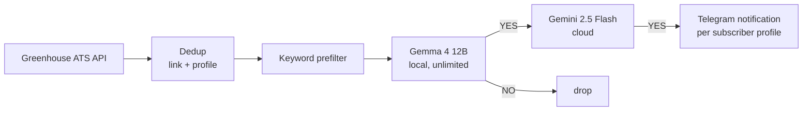

# JobRadar

[](https://github.com/AlexHalanyk/JobRadar/actions/workflows/tests.yml)

A Telegram bot that monitors company ATS APIs directly and notifies subscribers
about new graduate software engineering vacancies — often hours or days before
they appear on job aggregators.

Built as a real tool for my own 2027 UK grad-scheme search: rolling applications
reward whoever applies first, so the bot watches the primary source (the same
API a company's careers page is rendered from) instead of waiting for Indeed
or weekly digest emails.

## Highlights

- Runs 24/7 in production on self-hosted infrastructure (Nutanix VM, Docker)
- Local→cloud LLM cascade: 100% precision on a 70-title golden set
- 64 automated tests, CI on every push
- Zero-redeploy company onboarding: send a Greenhouse slug in chat
- Per-subscriber free-text filter profiles



## Features

- Monitors company ATS boards directly (Greenhouse for now), checking every
  15 minutes — often ahead of job aggregators.
- Three-gate filtering pipeline keeps cloud LLM cost near zero: dedup, then a
  keyword prefilter, then an LLM relevance cascade (self-hosted Gemma first,
  Gemini 2.5 Flash to confirm) for survivors.
- Self-service via chat: `/start` to subscribe, or send a Greenhouse slug or
  URL (e.g. `monzo`) to add a company to the watchlist — no redeploy needed.
- Per-subscriber filter profiles: `/profile <text>` lets each subscriber
  describe what they're looking for in free text; every job is evaluated
  once per distinct profile, and only matching subscribers get notified.
- Dedup via SQLite: every processed job is remembered, so nothing is
  evaluated or sent twice, even across restarts.
- Resilient to LLM API errors and rate limits: failures are retried next
  cycle instead of crashing the bot.

## Architecture

- `main.py` — runs two schedules: incoming Telegram messages are polled
  every 10 seconds (for chat responsiveness), while job boards are checked
  every 15 minutes.
- `bot.py` — services: sending/receiving Telegram messages, the Ollama
  client (local Gemma) and Gemini client (cloud), and SQLite persistence
  (sent jobs, subscribers, tracked companies).
- `sources.py` — ATS fetchers (Greenhouse, Lever, Workday), normalising job
  fields into a common shape (title, company, location, link, id). Workday
  support uses the internal CXS endpoint career sites themselves call to
  render job listings — there's no public API for it, so this is
  undocumented and may change without notice.
- `eval_filter.py` — offline benchmark against `golden_set.csv`, reporting
  accuracy/precision/recall per backend along with false positive/negative
  lists; run a single backend with `--backend`.

**Three-gate filtering pipeline**: a job first passes dedup (has this link
already been evaluated for this subscriber profile?), then a cheap keyword
filter drops obviously irrelevant titles without an API call. Survivors go
to an LLM relevance cascade: a self-hosted Gemma 4 12B (via Ollama, free and
unlimited) screens first, and only its YES verdicts are confirmed by Gemini
2.5 Flash. This was designed to keep cloud API usage minimal while
preserving cloud-level precision — Gemini's free tier caps out at 5
requests/minute, which motivated the design; the bot now runs on a paid
tier, but the cascade still cuts cloud costs to near zero. The backend is
switchable via `LLM_BACKEND=gemini|ollama|cascade`. LLM output is never
trusted blindly — it's normalised (`strip`/`upper`/substring check) since
the model occasionally returns `YES.`, `Yes`, or a full sentence instead of
one word, and API errors are skipped and retried next cycle rather than
treated as a rejection.

**Dedup via SQLite**: processed job links are stored in the `sent_jobs`
table so a job is only ever evaluated and sent once. The database lives in a
Docker volume so history survives restarts and redeploys.

## Evaluation

Relevance filtering is benchmarked offline against a golden set of ~70
hand-labelled job titles (`golden_set.csv`), across three configurations:

| Configuration | Accuracy | Precision | Recall | Coverage |
|---|---|---|---|---|
| Ollama (Gemma 4 12B, self-hosted) | 100% | 100% | 100% | 70/70 |
| Gemini | 100%* | 100%* | 100%* | 51/70 (19 undecided) |
| Cascade (Ollama → Gemini) | 98.6% | 100% | 90% | 70/70 |

\* Measured only over the titles Gemini returned a decision for — 19/70 came
back undecided due to Gemini API 503s at measurement time.

Cascade inherits the availability of both models: its one miss was caused by
the second-stage (Gemini) call being unavailable when the first stage
(Gemma) had already flagged the job as a candidate. Run `eval_filter.py` to
reproduce or rerun the benchmark.

## Tech stack

Python · SQLite · Docker / docker-compose · Telegram Bot API ·
Google Gemini API · Ollama · Gemma 4 12B · Greenhouse ATS API. Deployed on a
Nutanix AHV VM (git-based deploys: push → pull → rebuild).

## Setup

Environment variables (put them in `.env`, see `.env.example`):

- `TELEGRAM_TOKEN` — Telegram bot token from BotFather
- `GEMINI_API_KEY` — Google Gemini API key
- `LLM_BACKEND` — `gemini` (default), `ollama`, or `cascade`; see
  Architecture above for what each mode runs
- `OLLAMA_URL` — base URL of a reachable Ollama host (required for
  `ollama`/`cascade` backends)
- `OLLAMA_MODEL` — Ollama model name (defaults to `gemma4:12b`; required
  for `ollama`/`cascade` backends)

```
git clone https://github.com/AlexHalanyk/JobRadar.git
cd JobRadar
cp .env.example .env   # fill in TELEGRAM_TOKEN and GEMINI_API_KEY
docker compose up --build -d
```

## Roadmap

- [ ] Workday adapter for enterprise employers (banks, consultancies)
- [ ] Additional ATS adapters (Lever, Ashby, Workable)
- [ ] Mobile client
